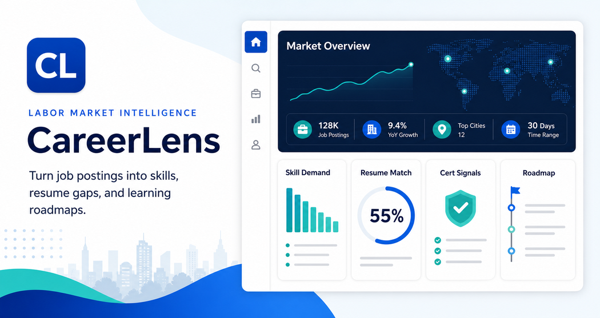

# CareerLens



CareerLens is a labor market intelligence dashboard for students preparing for internships and entry-level technology roles. It turns job-posting patterns into role insights, skill demand, certification signals, resume gaps, and application-ready next steps.

## Quick Links

- [Live App](https://jasonbinong.github.io/CareerLens/)
- [Portfolio Case Study](https://jasonbinong.github.io/careerlens-case-study.html)
- [Jason Binong Portfolio](https://jasonbinong.github.io/)

## Project Snapshot

| Area | Details |
| --- | --- |
| Status | Deployed portfolio product |
| Focus | Labor market intelligence, resume gaps, role comparison |
| Users | Students exploring internships, certifications, and early-career tech paths |
| Core Stack | HTML, CSS, JavaScript, Python, SQL |
| Deployment | GitHub Pages |

## What It Does

CareerLens helps students understand what employers are asking for before they spend months learning the wrong things. Users select a target role, paste or load job-posting text, review demanded skills and certifications, compare their resume against the market, and generate a learning roadmap.

## Key Features

- Role selection across student-facing tech paths
- Job-posting text analysis for skill and certification demand
- Resume gap comparison against selected role requirements
- Opportunity Radar for market pull, fit, proof strength, and credential signal
- Advisor-ready decision brief for the selected role
- Role-specific project, certification, and portfolio evidence recommendations
- Application packet with LinkedIn headline, resume focus, portfolio proof, interview story, and readiness note
- CSV analysis pipeline for reusable job-posting analysis
- SQL schema for storing postings, skill mentions, role summaries, and resume gap reports
- Downloadable CSV career-readiness report

## Tech Stack

- HTML/CSS
- JavaScript
- Python
- SQL
- CSV data workflow
- GitHub Pages

## What Reviewers Should Notice

- Converts unstructured job descriptions into structured career insights
- Combines data analysis, information systems, and student career planning
- Produces practical outputs instead of only charts
- Includes a path toward a larger backend/database product

## Case Study

### Problem

Students often apply to internships without knowing which skills, certifications, and portfolio evidence employers repeatedly ask for. Job descriptions contain useful signals, but those signals are hard to compare manually across roles.

### Solution

CareerLens turns job-posting text into a career-readiness report. Users select a target role, paste postings or load sample data, analyze skill and certification demand, compare resume text against role requirements, and generate a focused learning roadmap.

### Key Design Decisions

- Requires the user to select a role before analysis so the output is personalized
- Uses in-browser text analysis to stay fast, private, and deployable
- Adds Priority Insights and a Decision Brief so the analysis produces recommendations
- Includes a Python CSV pipeline so the project can scale beyond the browser app
- Includes a SQL schema to show how labor market data could be stored

## How To Run

Open `index.html` in a browser.

No installation is required for the static app.

## Data Pipeline

CareerLens also includes a Python pipeline for analyzing job-posting CSV files.

```bash
python scripts/analyze_postings.py
```

This reads:

```text
data/sample_postings.csv
```

And writes:

```text
output/market_report.json
output/role_skill_summary.csv
```

## Future Improvements

- Add a backend for larger job-posting ingestion
- Store posting history and user reports in SQL
- Connect live job-board APIs
- Export Power BI-ready summaries
- Add AI-assisted resume rewrite suggestions
